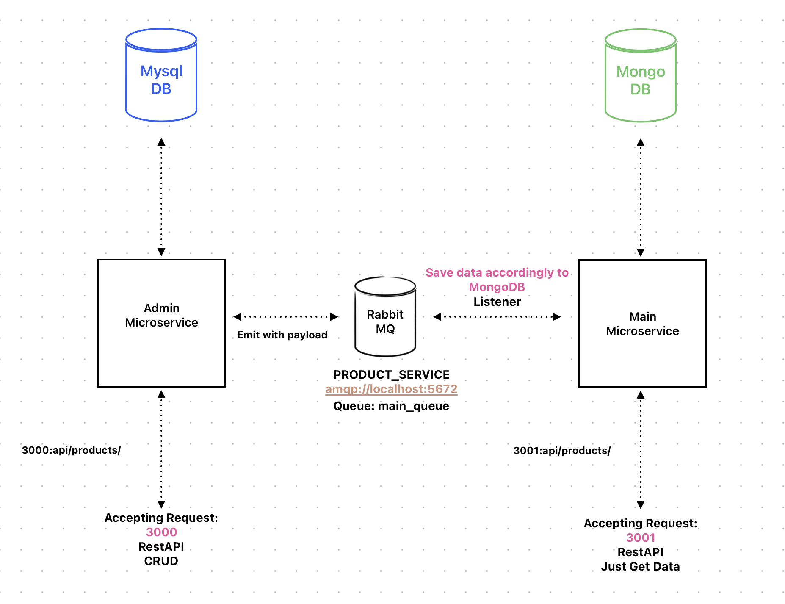

<p align="center">
  <a href="http://nestjs.com/" target="blank"></a>
</p>

## Description

2 Standalone App in [NestJS](https://github.com/nestjs/nest) that communicate with RabbitMQ <br />
Schema below:


## Installation

cd to each app to run seprately

```bash
# for running Mysql & Mongo & RabbitMQ
$ docker-compose  --env-file ./admin/src/config/.env up
```
